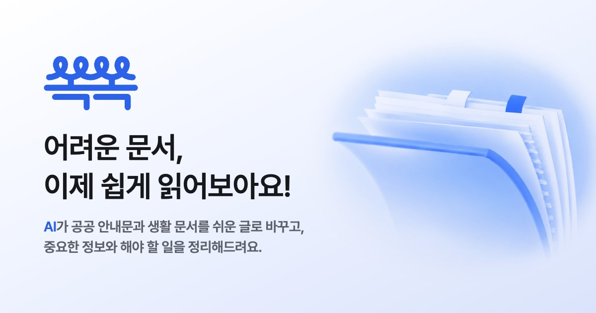
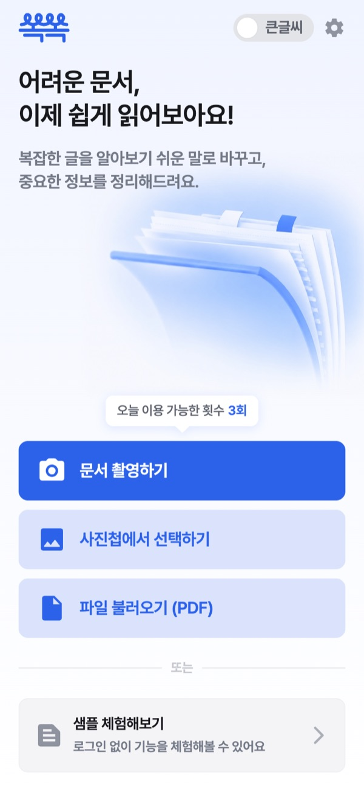
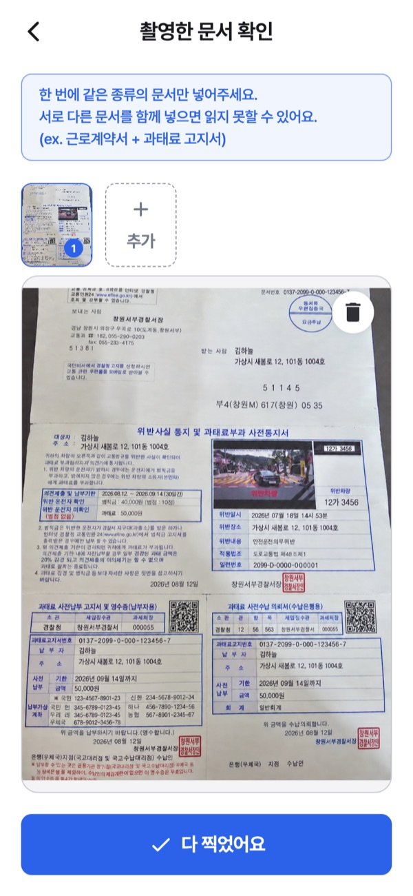
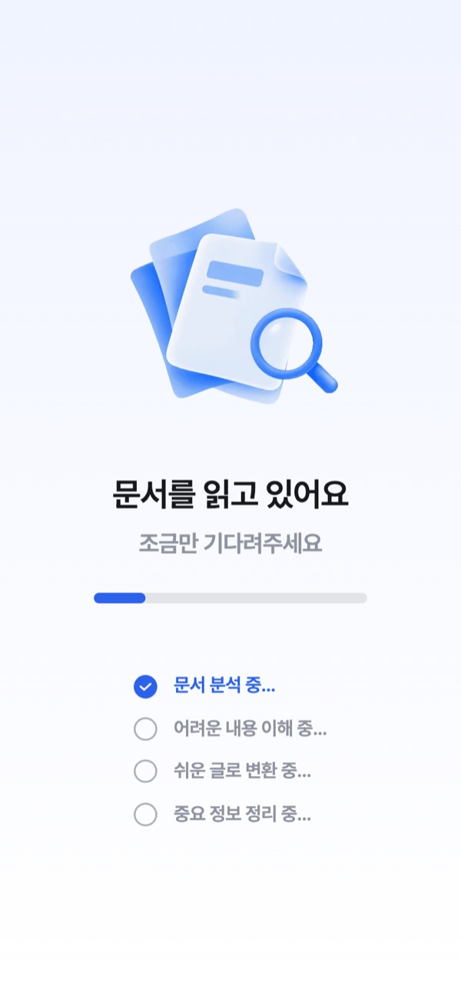
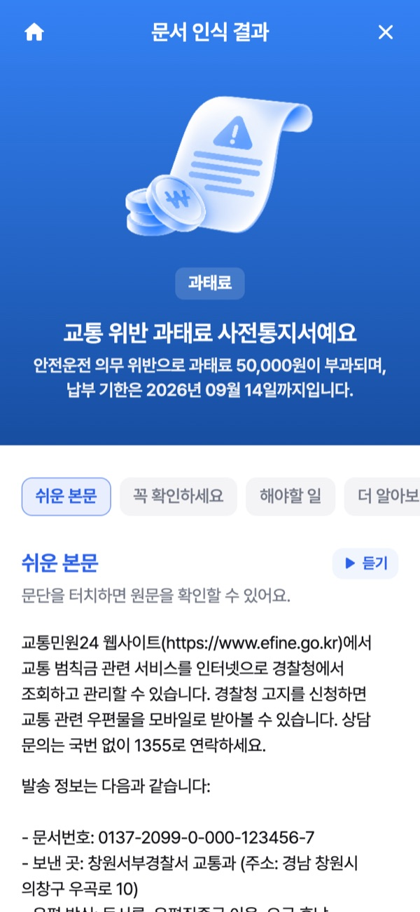
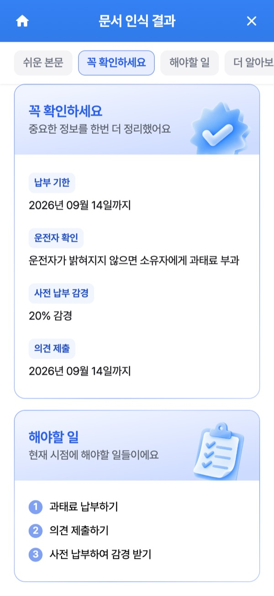
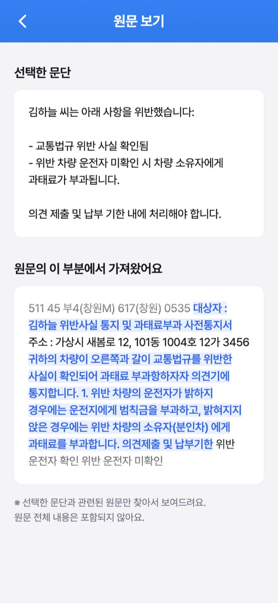
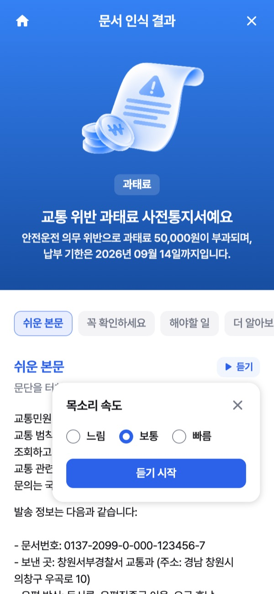
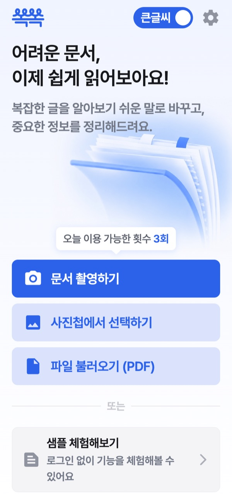

<p align="center">
  
</p>

# 쏙쏙

[](https://github.com/ssokssok-app/ssokssok-frontend/actions/workflows/ci.yml)

> 어려운 문서를 사진으로 찍으면 쉬운 글로 바꿔 드려요.

과태료 통지서, 근로계약서, 국민연금 안내문. 꼭 읽어야 하는데 읽기 어려운 문서가 있어요.
쏙쏙은 문서를 찍으면 쉬운 말로 풀어 주고, **언제까지 무엇을 해야 하는지**를 따로 정리해 주는 모바일 웹이에요.

- 서비스: **https://www.ssokssok.site** (가입 없이 하루 3번. 샘플 문서로 먼저 체험할 수 있어요)
- 주 사용자: 고령층, 발달장애인, 외국인 노동자
- 원티드 해커톤 프로젝트이고, 이 레포는 웹 프론트엔드예요

## 주요 기능

|                          문서 넣기                           |                                 여러 장 확인                                 |                                       읽는 중                                        |                                쉬운 글 결과                                |
| :----------------------------------------------------------: | :--------------------------------------------------------------------------: | :----------------------------------------------------------------------------------: | :------------------------------------------------------------------------: |
|  |  |  |  |
|       촬영, 사진첩, PDF 로<br />넣어요. 가입은 없어요        |                한 문서를 10장까지<br />이어서 넣을 수 있어요                 |                       1분쯤 걸려요.<br />진행 단계를 보여 줘요                       |              무슨 문서인지 알려 주고<br />쉬운 말로 풀어 줘요              |

|                                       꼭 확인하세요                                        |                                  원문 보기                                   |                                        듣기                                         |                                     큰글씨 모드                                     |
| :----------------------------------------------------------------------------------------: | :--------------------------------------------------------------------------: | :---------------------------------------------------------------------------------: | :---------------------------------------------------------------------------------: |
|  |  |  |  |
|                         기한 · 금액 · 할 일만<br />따로 뽑아 줘요                          |               문단을 누르면 원문의<br />어느 줄인지 보여 줘요                |                  기기 목소리로 읽어 줘요.<br />속도는 세 가지예요                   |                  모든 글자가 4px 커지고<br />버튼도 같이 늘어나요                   |

결과는 PDF 로 저장할 수 있어요. 사진 속 문서는 샘플용 가상 문서라 이름 · 주소 · 번호가 모두 가짜예요.

## 화면도 쉬워야 해서

글을 읽기 어려운 분들이 쓰는 앱이라, 변환 결과만 쉬워서는 부족했어요. 화면에는 이런 원칙을 정했어요.

- **로그인이 없어요.** 소셜 로그인이 가장 큰 문턱이었어요. 대신 기기마다 하루 3번으로 제한해요.
- 아이콘만 있는 작은 버튼도 **누르는 영역은 40px 이상**이에요.
- 한국어는 단어 중간에서 줄을 바꾸지 않아요. "있 / 어요" 처럼 끊기면 읽기 어려워요.
- 꼭 봐야 하는 안내는 잠깐 떴다 사라지는 알림 대신 **창**으로 띄워요. PDF 를 저장하면 어느 폴더에서 찾는지까지 알려 줘요.
- 촬영은 웹 카메라 화면을 만들지 않고 **휴대폰 기본 카메라**를 열어요. 사진이 또렷해야 글자를 잘 읽고, 플래시도 쓸 수 있어요.

원칙마다 정한 날짜와 이유는 [docs/product.md](docs/product.md) 에 있어요.

## 기술적 도전

### 큰글씨 모드가 조용히 깨지는 문제

`text-[15px]` 같은 임의 크기가 하나만 섞여도 그 글자만 큰글씨에서 안 커져요. 눈으로는 놓치기 쉬워서, 글자 크기는 Figma 토큰으로만 쓰고 어기면 `pnpm check:font-scale` 이 실패하게 했어요.
[자세히 보기](docs/harness.md)

### AI 가 틀렸을 때 사용자가 알아챌 방법

AI 가 금액이나 기한을 잘못 옮기면 피해가 커요. 문단마다 근거가 된 원문 줄을 같이 받아서, 문단을 누르면 원문에서 그 줄을 강조해 보여 줘요. 줄 안의 일부만 강조하는 방식은 AI 가 원문을 한 글자도 안 틀리고 옮겨 적어야 해서 버렸어요.
[자세히 보기](docs/product.md#결과-화면)

### 개인정보가 담긴 문서

사진과 결과는 메모리에만 두고 localStorage, 주소, 콘솔 어디에도 남기지 않아요. 듣기도 기기 안 목소리만 써요. PC 크롬의 인터넷 목소리는 읽을 글을 구글 서버로 보내거든요.
[자세히 보기](AGENTS.md#개인정보--보안-p0)

### 1분 30초짜리 로딩

기다리다 멈춘 줄 알고 나가는 게 문제였어요. 로딩 네 단계를 서버의 실제 진행 단계와 맞추고, 진행 막대는 서버 값보다 10% 넘게 앞서지 않게 했어요. 남은 시간은 일부러 안 보여 줘요. 틀린 숫자가 더 불안하니까요. 기다리는 동안 화면도 꺼지지 않아요.
[자세히 보기](docs/product.md#결과-화면)

### 카카오톡으로 받은 링크

안드로이드의 앱 안 브라우저에는 기기 목소리가 없고 파일 저장도 막히는 경우가 있어요. 카카오톡 · 네이버 같은 앱 안에서 열리면 바깥 브라우저로 넘겨요.
[자세히 보기](docs/product.md#ux-원칙)

### 느린 인터넷

로딩 일러스트가 2.5MB 짜리 GIF 였어요. 투명 배경 동영상(HEVC · WebM)으로 바꿔 290KB 로 줄였고, 사진은 올리기 전에 브라우저에서 긴 변 2000px 로 줄여요.

## AI 와 함께 개발해요

코드 대부분은 Claude Code 가 썼어요. 대신 무엇을 만들지는 사람이 정하고, AI 가 틀리면 그 자리에서 드러나도록 장치를 걸어 뒀어요.

| 누가        | 하는 일                                                                                                     |
| ----------- | ----------------------------------------------------------------------------------------------------------- |
| 사람        | 무엇을 만들지, Figma 와 다르게 갈지, 백엔드와 무엇을 합의할지 결정. 날짜 · 이유와 함께 문서에 기록. PR 병합 |
| Claude Code | 구현, 테스트, 문서 갱신                                                                                     |
| 자동 검사   | 파일을 고칠 때마다 Prettier · oxlint, 작업을 끝낼 때 `pnpm check`. 실패하면 다시 고치게 함                  |
| Codex       | PR 리뷰. 기준은 [AGENTS.md](AGENTS.md), 1순위는 개인정보                                                    |

해 보면서 남은 것들이에요.

1. **같은 실수가 두 번 나오면 글로 부탁하지 않고 검사로 만들어요.** 에러 메시지에 위치, 이유, 고치는 방법을 적어 두면 그게 곧 AI 에게 주는 지시가 돼요.
2. **매번 읽히는 `CLAUDE.md` 는 100줄짜리 지도로만 둬요.** 세부 내용은 `docs/` 에, 폴더 전용 규칙은 그 폴더 파일을 열 때만 읽히는 `.claude/rules/` 에 있어요.
3. **결정은 날짜와 이유를 붙여 기록해요.** AI 는 세션이 바뀌면 기억이 없어서, [docs/product.md](docs/product.md) 가 다음 세션의 기억이에요.
4. **리뷰는 다른 모델에게 맡겨요.** 인터넷 목소리로 개인정보가 나가는 문제는 코드를 쓴 모델이 아니라 리뷰하던 Codex 가 찾았어요.
5. **Figma 는 MCP 로 직접 읽어요.** 화면에 쓰인 스타일만 조회했다가 토큰 몇 개를 빠뜨린 뒤로는 파일에 정의된 스타일 전체를 뽑아요.

화면 단위 자동 테스트(E2E)와 접근성 자동 검사는 아직 없어요. 장치 전체는 [docs/harness.md](docs/harness.md) 에 있어요.

## 기술 스택

| 분류            | 사용                                                            |
| --------------- | --------------------------------------------------------------- |
| 화면            | React 19 (React Compiler), TypeScript, Tailwind CSS v4, Base UI |
| 라우팅 · 데이터 | TanStack Router (파일 기반), TanStack Query                     |
| 빌드 · 검사     | Vite, Vitest, oxlint, Prettier, pnpm                            |
| 배포 · CI       | Vercel, GitHub Actions                                          |
| 백엔드          | FastAPI (별도 비공개 레포). OCR 과 쉬운 글 변환 담당            |

## 시작하기

Node 22, pnpm 10 이 필요해요.

```bash
git clone https://github.com/ssokssok-app/ssokssok-frontend.git
cd ssokssok-frontend
pnpm install
pnpm dev   # http://localhost:5173
```

환경 변수 없이 바로 돌아요 (`.env.example` 의 값은 지금 꺼 둔 로그인에만 써요). 백엔드도 따로 띄울 필요 없어요. 개발 서버가 `/api` 를 배포된 백엔드로 넘겨 줘요.
다만 실제 문서를 넣으면 개발 중에도 OCR · AI 비용이 나가요. 화면 작업은 샘플 문서로 해 주세요.

| 명령어        | 하는 일                                                      |
| ------------- | ------------------------------------------------------------ |
| `pnpm dev`    | 개발 서버. `/dev/components` 는 공용 컴포넌트 카탈로그       |
| `pnpm test`   | 로직 테스트 (Vitest)                                         |
| `pnpm check`  | 라우트 생성, lint, 타입, 테스트, 포맷, 규칙 검사 (빌드 제외) |
| `pnpm verify` | `pnpm check` + 프로덕션 빌드. CI 가 PR 마다 돌리는 검사      |

## 폴더 구조

```text
src/
  routes/       화면 (파일 기반 라우트). 화면 전용 부품은 -result 같은 - 폴더에
  api/          백엔드 호출, queryOptions, 응답 모양 검사
  components/   Figma 공용 컴포넌트 (Base UI). ui/ 는 shadcn 원본
  hooks/        여러 화면에서 쓰는 훅
  lib/          전역 유틸, 기능 스위치, 기기 번호
  assets/       Figma 에서 받은 아이콘 · 일러스트 · 동영상
scripts/        검사 스크립트
docs/           제품 · 구조 · API 계약 · Git · CI · 하네스 문서
.claude/        에이전트 훅과 경로별 규칙
```

## 문서

| 문서                                         | 내용                                             |
| -------------------------------------------- | ------------------------------------------------ |
| [docs/product.md](docs/product.md)           | 사용자, UX 원칙, 화면별로 정한 것과 그 이유      |
| [docs/architecture.md](docs/architecture.md) | 폴더 역할, 데이터 흐름, 백엔드 연동, 테스트 규칙 |
| [docs/api-contract.md](docs/api-contract.md) | 백엔드와 맞춘 API 계약                           |
| [docs/git.md](docs/git.md)                   | 커밋 · 브랜치 · PR 규칙                          |
| [docs/ci.md](docs/ci.md)                     | CI, 레포 설정, Vercel 배포                       |
| [docs/harness.md](docs/harness.md)           | 훅, 검사 스크립트, 문서 체계                     |

## 팀

|  |  |  |
| :----------------------------------------------------------------------------: | :-------------------------------------------------------------------------: | :--------------------------------------------------------------------------: |
|                     [황채영](https://github.com/chae00-00)                     |                     [윤지원](https://github.com/wony12)                     |                     [서민수](https://github.com/seomsoo)                     |
|                                     백엔드                                     |                                   디자인                                    |                                  프론트엔드                                  |
